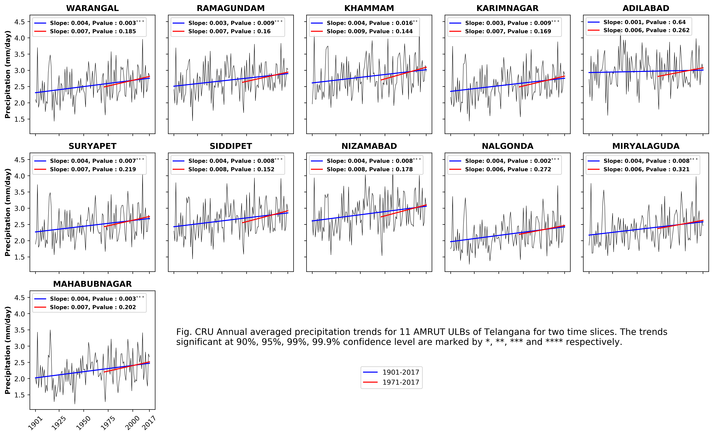
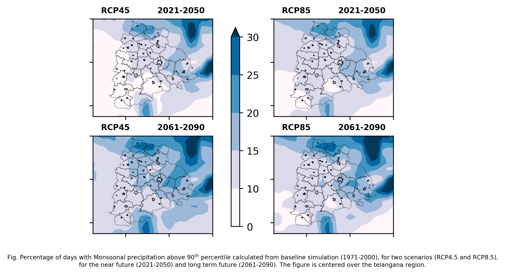
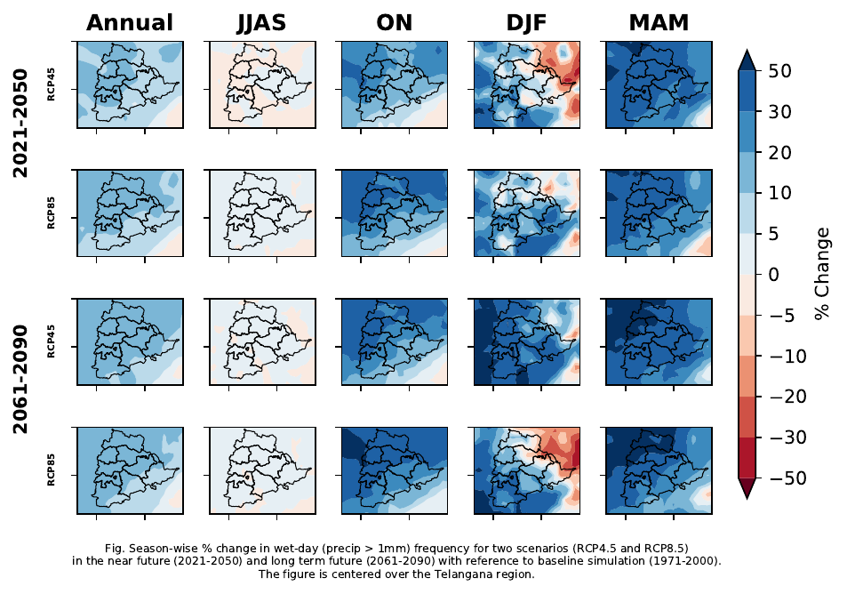
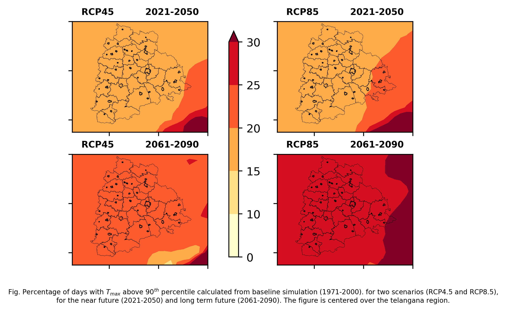
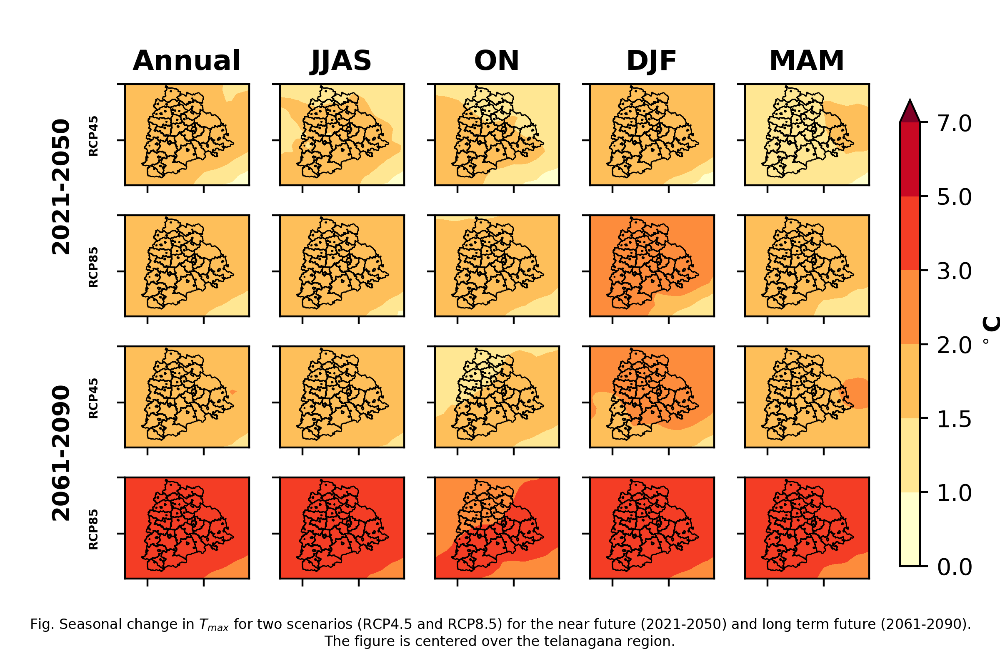
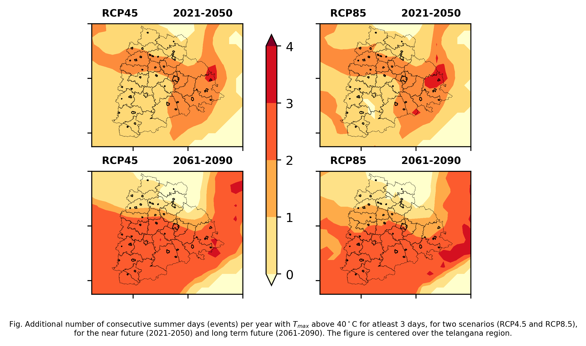

# Dynamically downscaled projections from an ensemble of regional climate models (CORDEX)
The Coordinated Regional Downscaling Experiment (CORDEX) is a program sponsored by World Climate Research Program (WCRP) to develop an improved framework for generating regional-scale climate projections for impact assessment and adaptation studies worldwide within the IPCC AR5 timeline and beyond. The program consists of several subcomponents: Development of a framework for evaluating downscaling methodologies; develop improved downscaling techniques, both statistical and dynamical; and promote interactions among global climate modelers, downscaling modelers, and assessment community who assess the impact of climate change on specific sectors using the downscaled data. An essential component of CORDEX is the evaluation of multiple regional models for a 20-year (1989-2007) hindcast period with the lateral boundary forcing obtained from ERA-Interim reanalysis. These evaluations are critical to characterizing the strengths and weaknesses of these models for their use in producing future projections regional climate change where the lateral boundary forcing is provided by multiple GCMs and emissions scenarios from the CMIP5 archive.

## Data Analysis

- Analyzed large atmospheric science ensemble simulation datasets using Dask for lazy loading in memory-constrained systems, xarray for Multi-Dimensional Data, pandas and numpy for data analysis, and various visualization tools (matplotlib, seaborn, plotly) in Python
- Implemented ICCLIM and CLIMDEX indices to provide projections on climate extremes
- Assessed the statistical signifance of simulations of dynamically downscaled Ensemble models and provided projections for anomaly for all the four variables 
- Time series analyses of regional models of ensemble projections

## Analysis of Cordex Ensemble projections for IPCC scenarios

### IMD precipitation trends

### Change in Extreme Precipitation (90 percentile)

### Change in wet day frequency 

### Change in Extreme Temperature (90 percentile)

### Change in maximum temperature

### Heatwave projection - Change in number of days with Max Temp > 40C for atleast 3 days

